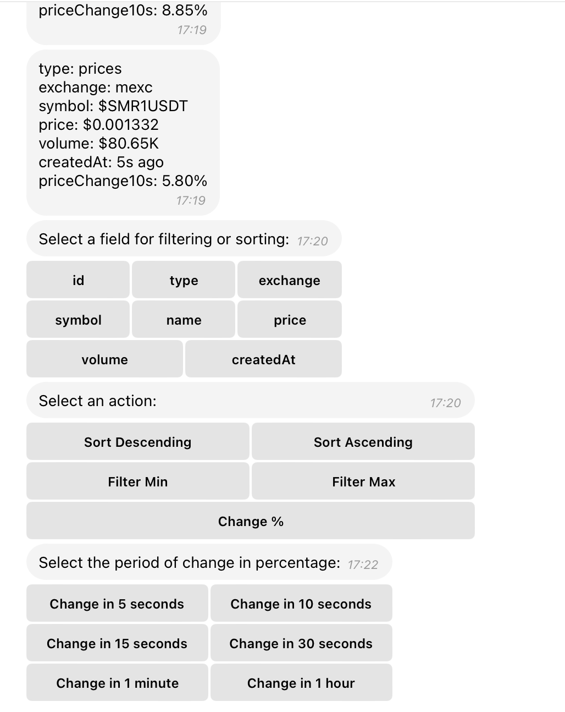

# @cryptoscan/cryptobot-tg

# @cryptoscan/cryptobot-tg



## Description

@cryptoscan/cryptobot-tg is a Telegram bot that allows users to interact with cryptocurrency data. The bot provides the ability to sort and filter data by various parameters, as well as track changes in real-time.

## Installation

1. Clone the repository:
   ```bash
   git clone git@github.com:cryptoscan-pro/crypto-bot-tg.git
   ```
2. Navigate to the project directory:
   ```bash
   cd cryptoscan-cryptobot-tg
   ```
3. Install dependencies:
   ```bash
   npm install
   ```

## Configuration

Create a `.env` file based on `.env.example` and specify the necessary environment variables:

- `BOT_TOKEN`: This is the API key for your Telegram bot. It is required to authenticate and interact with the Telegram API.
- `WEBSOCKET`: Set this to `1` to use WebSockets for real-time data updates, or `0` to use HTTP.

These configurations are crucial for the bot's operation, determining how it connects to Telegram and whether it uses WebSockets or HTTP for data communication.

## Running

To start the bot, use the command:
```bash
npm start
```

## Usage

After starting the bot, you can interact with it via Telegram. The command flow is as follows:

1. Start the bot with the command `/start`.
2. The bot will display buttons for selecting a data type, such as `types`, `arbitrage`, `contracts`, `networks`.
3. Next, choose a field for sorting or filtering, such as `id`, `type`, `exchange`, `symbol`, `name`, `price`, `volume`, `createdAt`.
4. Then, select an action: sorting, filtering, or change percentage. Options include:
   - For numbers: `sort desc`, `sort asc`, `filter min`, `filter max`, `change %`.
   - For strings: `filter`.
   - Sorting is available for both types.
5. If `change %` is selected, choose an interval: `change5s`, `10s`, `15s`, `30s`, `1 min`, `1 hour`.
6. Finally, decide whether to continue adding options or save the configuration. The bot will then start listening for changes.

### Option Sets

The option sets in the bot are used to customize how data is retrieved and displayed. They allow users to:

- **Select Data Types**: Choose the type of cryptocurrency data to interact with, such as `types`, `arbitrage`, `contracts`, `networks`.
- **Choose Fields**: Specify which fields to sort or filter:
  - `id`: Unique identifier for the data entry.
  - `type`: The type of

## Description

@cryptoscan/cryptobot-tg is a Telegram bot that allows users to interact with cryptocurrency data. The bot provides the ability to sort and filter data by various parameters, as well as track changes in real-time.

## Installation

1. Clone the repository:
   ```bash
   git clone git@github.com:cryptoscan-pro/crypto-bot-tg.git
   ```
2. Navigate to the project directory:
   ```bash
   cd cryptoscan-cryptobot-tg
   ```
3. Install dependencies:
   ```bash
   npm install
   ```

## Configuration

Create a `.env` file based on `.env.example` and specify the necessary environment variables:

- `BOT_TOKEN`: This is the API key for your Telegram bot. It is required to authenticate and interact with the Telegram API.
- `WEBSOCKET`: Set this to `1` to use WebSockets for real-time data updates, or `0` to use HTTP.

These configurations are crucial for the bot's operation, determining how it connects to Telegram and whether it uses WebSockets or HTTP for data communication.

## Running

To start the bot, use the command:
```bash
npm start
```

## Usage

After starting the bot, you can interact with it via Telegram. The command flow is as follows:

1. Start the bot with the command `/start`.
2. The bot will display buttons for selecting a data type, such as `types`, `arbitrage`, `contracts`, `networks`.
3. Next, choose a field for sorting or filtering, such as `id`, `type`, `exchange`, `symbol`, `name`, `price`, `volume`, `createdAt`.
4. Then, select an action: sorting, filtering, or change percentage. Options include:
   - For numbers: `sort desc`, `sort asc`, `filter min`, `filter max`, `change %`.
   - For strings: `filter`.
   - Sorting is available for both types.
5. If `change %` is selected, choose an interval: `change5s`, `10s`, `15s`, `30s`, `1 min`, `1 hour`.
6. Finally, decide whether to continue adding options or save the configuration. The bot will then start listening for changes.

### Option Sets

The option sets in the bot are used to customize how data is retrieved and displayed. They allow users to:

- **Select Data Types**: Choose the type of cryptocurrency data to interact with, such as `types`, `arbitrage`, `contracts`, `networks`.
- **Choose Fields**: Specify which fields to sort or filter:
  - `id`: Unique identifier for the data entry.
  - `type`: The type of cryptocurrency data.
  - `exchange`: The exchange platform where the cryptocurrency is traded.
  - `symbol`: The ticker symbol representing the cryptocurrency.
  - `name`: The full name of the cryptocurrency.
  - `price`: The current price of the cryptocurrency.
  - `volume`: The trading volume of the cryptocurrency.
  - `createdAt`: The timestamp when the data entry was created.
- **Apply Actions**: Determine how to manipulate the data, including sorting, filtering, or changing percentages. This helps in organizing and analyzing data effectively.
- **Set Change Intervals**: When using the `change %` option, select intervals to monitor data changes over time:
  - `5s`: Track changes in price over 5 seconds.
  - `10s`: Track changes in price over 10 seconds.
  - `15s`: Track changes in price over 15 seconds.
  - `30s`: Track changes in price over 30 seconds.
  - `1 min`: Track changes in price over 1 minute.
  - `1 hour`: Track changes in price over 1 hour.

These options provide flexibility in data handling, enabling users to tailor the bot's functionality to their specific needs.

## Key Features

- **Sorting**: Ability to sort data in ascending or descending order.
- **Filtering**: Set minimum and maximum values for data filtering.
- **Change Tracking**: Ability to track data changes in real-time.

## Contribution

If you want to contribute to the project, please fork the repository and submit a pull request with your changes.

## License

This project is licensed under the MIT License.
